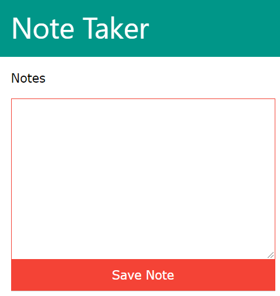

# note-taker
Quick note taker (personal/single user version)

# Installation
chmod -R 777 notes/

# Frequently Asked Questions
__What is this product all about?__
It is a *simple* note taker.

__Why single user version?__

__Why does not it allow to edit notes?__
Notes are expected to be managed on your mobile's note application.
You can use any popular note taker like [colornote](https://play.google.com/store/apps/details?id=com.socialnmobile.dictapps.notepad.color.note) by [Social & Mobile](https://www.colornote.com/).
You will edit the notes in the note application itself. Then,
You will submit the finalized notes to this note taker in order to transfer them to computer.

__Is note taker safe?__
No. Data saved are stored as plain text notes.
Since the notes are personal or single user version, you are responsible to store them safely.

__What information is lost?__
Links, colors, dates of note, title of note, search capability, sort capability.

# Screenshot

