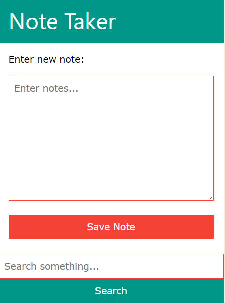

# note-taker
Quick note taker (personal/single user version)

# Installation

    chmod -R 777 notes/
    chmod -R 777 notes.deleted/

# Story
A lot of notes got created on a phone device using ColorNote. One day, it is a time to review them and be able to edit through computer.
So, there was a need for transferring notes from phone device to web/LAN.

# Frequently Asked Questions
__What is this product all about?__
It is a *simple* note taker.
It helps to transform your notes from phone or tablet to web/computer.

__Why single user version?__

__Why does not it allow to edit notes?__
Notes are expected to be managed on your mobile's note application.
You can use any popular note taker like [colornote](https://play.google.com/store/apps/details?id=com.socialnmobile.dictapps.notepad.color.note) by [Social & Mobile](https://www.colornote.com/).
You will edit the notes in the note application itself. Then,
You will submit the finalized notes to this note taker in order to transfer them to computer.

However, a basic editor is a work in progress.

__Is note taker safe?__
No. Data saved are stored as plain text notes.
Since the notes are personal or single user version, you are responsible to store them safely.

__How can I safeguard my notes?__
Install this note taker in a safe location, like your personal NAS or home network.
Again, be aware that the notes are saved in plain text files.

Cloud and web servers are not the expected destinations to use this note taker.

__What information is lost?__
Links, colors, dates of note, title of note

__What capabilities are lost?__
Search, sort, share, archive.

# Screenshot

